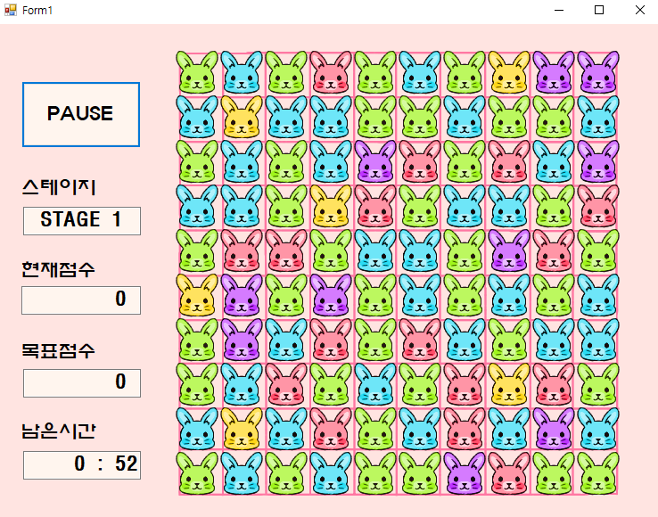
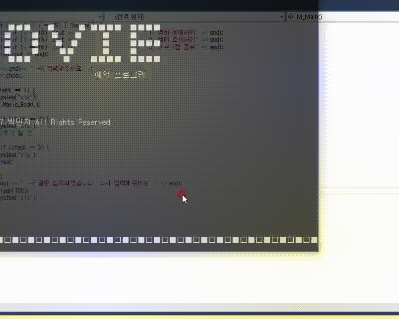

# Introduce
<h2><u>박민지 프로젝트 관리 (Park-New-project)</u></h2>

<ul>

 <h3>1학년 1학기</h3>
 <li>C언어 수강</li> 
 <li>여름방학 : <b>C# WinForm 멘토링 333매칭 퍼즐 GUI 프로그램 (ex 애니팡)</b></li> 
  

 

 <h3>1학년 2학기</h3>
 <li>C++ 프로젝트 :  <b> 콘솔 UI 영화 예매 프로그램 (Movie_Ticketing)</li></b> 
  
  https://github.com/Park-New-project/Movie_Ticketing  
 <li>레고 마인드 스톰 : 선따라 길찾는 로봇</li> 
 <li>겨울방학 : html, css, Javascript, python web 사진 / 게시물 관리 웹서비스</li> 

<h3>2학년 1학기</h3>
 <li>자바 프로젝트 : <b>Java 일정관리 스레드 동기화 메모 캘린더</b></li> 
 <li>자료 구조 (C언어) 수강 </li> 
  
 <li>여름 방학 :  <b>Android (Java) & Firebase 이용 식단/건강/습관 관리 앱 '햇님안햇님'</b></li> 

<h3>2학년 2학기</h3>
 <li>알고리즘 : C, C++ 이용</li> 
  <li> 겨울방학 : Python Django 인공지능 사진분류 웹서비스 </li> 
  

<h3>3학년 1학기</h3>
 <li>프로그래밍 언어론 (알고리즘2) : C, C++, C#, Unity 하노이 탑 (Tower of Hanoi(BFS))</li> 
  
   https://github.com/Park-New-project/Tower_of_Hanoi_BFS   
 <li>크라우드 펀딩 웹서비스 (CrowdFunding Web Service)</li> 
 https://github.com/Park-New-project/CrowdfundingWebService  

<h3>3학년 2학기</h3>
 - Now Updating! 

</ul>
